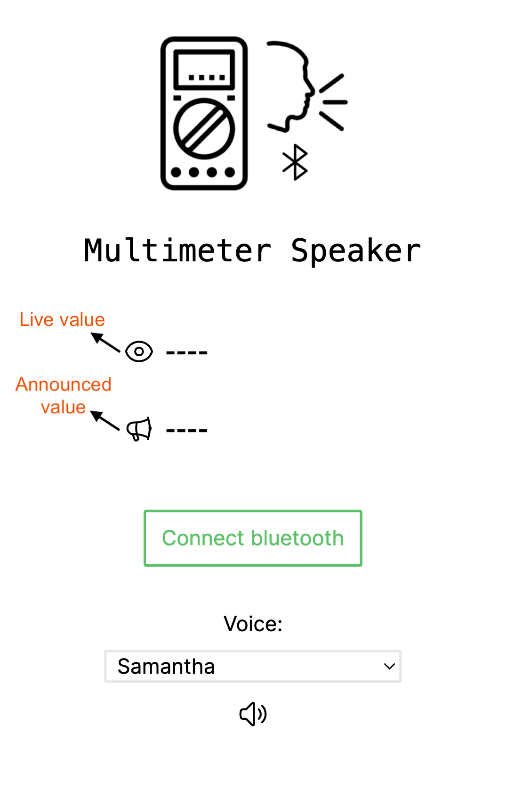

# [Multimeter speaker](https://multimeter-speaker.netlify.app/)

[](https://multimeter-speaker.netlify.app/)



## Details

- Connects with Aneng BLE Multimeters using Bluetooth and announces values using Web Speech api.
- Reciprocates buzz with a tone of 2800 Hz.
- Only works with Aneng Big multimeters at the moment (Aneng-9002, BSIDE ZT-300AB, ZOYI ZT-300AB, BABATools AD-900).
- Thanks to @ludwich66 for decoding the protocol at https://github.com/ludwich66/Bluetooth-DMM/wiki/Protocol-all-Variants
- "Live value" shows instant value received from DMM.
- Live value is then debounced and repeat values are removed to get "Announced value".
- "Announced value" is shown in UI and also spoken using Web Speech api. The voice model used can be changed in UI (choice depends on OS).
- When multimeter's Buzz symbol is ON and DIODE symbol is OFF, that indicates multimeter is buzzing. The app also generates a tone of 2800 Hz with 70% volume to make the buzz more audible. (Actual multimeter uses 2150 Hz, but I like this one better.)
- Doesn't work on IOS, because Web Bluetooth Api is not supported. Works on Android, Mac, Windows.
- Supports PWA app installation and offline mode.
- Added automatic BLE reconnect feature (if connection is lost from DMM side). If user clicks "Disconnect" button manually, reconnect is temporarily disabled till next reconnect.

## Todo

- Support other size multimeters from Aneng
- Allow configuring volume, pitch, buzz volume, buzz frequency, auto re-connect
- Allow custom template

## Contribution

**It uses Next.js framework with @ducanh2912/next-pwa for offline support. It is deployed on Netlify.**

First, run the development server:

```bash
npm run dev
# or
yarn dev
# or
pnpm dev
```

Open [http://localhost:3000](http://localhost:3000) with your browser to see the result.

## Help

Please raise an issue if your Aneng DMM is not supported properly. Feel free to contribute changes.
